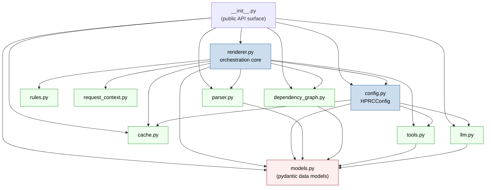
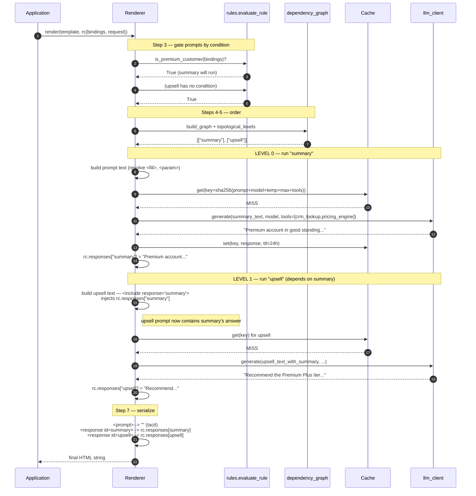

# HPRC Architecture

The **HPRC Framework** (HTML Prompt Response Construction) is an AI-native server-side
templating engine that integrates with any web framework — FastAPI, Flask, Django — or
runs standalone. Developers write **SPREP templates** (Simple Prompt Response Embedded
Pages) — HTML with embedded `<prompt>` blocks (in `.sprep.html` files) and `<response>`
placeholders marking where the answers go — and HPRC executes the prompts during
rendering — in a sequential order by default and optionally concurrently or a combination
of both, with caching — then serializes the final HTML.

The design goal is **separation of concerns**: templates stay declarative
(what to ask, where to put it), while business logic (rules), capabilities
(tools), the model backend (LLM client) and caching all live in Python and are
injected through a single `HPRCConfig`. Prompts are *tacit* — they are
executable but never appear in the rendered output.

---

## 1. Component Diagram — Application Developer vs HPRC

HPRC exposes exactly four pluggable seams to the application developer, bundled
in `HPRCConfig`. Everything else is HPRC's responsibility.

```
┌──────────────────────────────────────────────────────────────────────────────┐
│                        APPLICATION DEVELOPER OWNS                              │
│                                                                                │
│   ┌────────────────────┐   ┌──────────────────────────────────────────────┐   │
│   │  .sprep.html         │   │  HPRCConfig  (the 4 pluggable seams)         │   │
│   │  template           │   │                                              │   │
│   │  ─────────────      │   │   llm_client : LLMClient                     │   │
│   │  <fill>, <param>    │   │     └ which model backend (OpenAI/Mock/...)  │   │
│   │  <prompt id=...>    │   │   rules      : {name -> predicate(bindings)}  │   │
│   │  <response id=...>  │   │     └ business logic (is_premium_customer)   │   │
│   │  <include .../>     │   │   tools      : {name -> callable}            │   │
│   │  condition="rule"   │   │     └ allowlisted external capabilities      │   │
│   │  tools="a,b"        │   │   cache      : Cache                         │   │
│   │  cache="24h"        │   │     └ Memory / Null / (Redis, future)        │   │
│   └─────────┬──────────┘   └───────────────────┬──────────────────────────┘   │
│             │                                  │                               │
│             │   bindings={...}, request=<framework request>                    │
└─────────────┼──────────────────────────────────┼──────────────────────────────┘
              │                                  │
              ▼                                  ▼
┌──────────────────────────────────────────────────────────────────────────────┐
│                              HPRC OWNS                                         │
│                                                                                │
│   parser ──► models ──► request_context (normalize) ──► rules (evaluate)      │
│      │                                                       │                  │
│      └──► dependency_graph (build + topological levels)      │                  │
│                                  │                           │                  │
│                                  ▼                           ▼                  │
│                            ┌────────────────────────────────────┐              │
│                            │           Renderer                  │              │
│                            │  • build prompt text (fills/inc.)   │              │
│                            │  • concurrent level execution       │              │
│                            │  • cache lookup/store               │              │
│                            │  • serialize document (tacit prompts)│             │
│                            └────────────────────────────────────┘              │
│                                                                                │
│   HPRC does NOT: choose a model, contain business logic, implement an agent    │
│   loop, depend on FastAPI/Flask/Django, or hardcode a cache backend.           │
└──────────────────────────────────────────────────────────────────────────────┘
                                   │
                                   ▼
                          Final HTML string
```

**Responsibility split**

| Concern                         | Owner        | Where                          |
|---------------------------------|--------------|--------------------------------|
| Prompt wording & placement      | App developer| `.sprep.html` template          |
| Which model / temperature       | App developer| `model=`, `temperature=` attrs |
| Business logic (who gets what)  | App developer| `rules` in `HPRCConfig`        |
| External capabilities           | App developer| `tools` in `HPRCConfig`        |
| Model backend / network calls   | App developer| `llm_client` impl             |
| Parsing, indexing               | HPRC         | `parser.py`, `models.py`       |
| Request normalization           | HPRC         | `request_context.py`           |
| Rule lookup & gating            | HPRC         | `rules.py` + renderer step 1   |
| Dependency ordering             | HPRC         | `dependency_graph.py`          |
| Concurrency & caching           | HPRC         | `renderer.py`, `cache.py`      |
| Serialization (tacit prompts)   | HPRC         | `renderer.py`                  |

---

## 2. The Render Pipeline

The orchestration core is `Renderer.render()` in `renderer.py`. The public entry
points (`render_template`, `render_template_string`, `render_string`) wrap it.

```
 INPUT: template_html/path, request, bindings, HPRCConfig
   │
   ▼
┌─────────────────────────────────────────────────────────────────────────────┐
│ (1) PARSE                                                  parser.parse()     │
│     html.parser builds a tolerant Node tree (round-trippable):               │
│       • text/entities/comments/doctype preserved verbatim                    │
│       • second pass indexes <prompt> + <response> into typed definitions     │
│     ──► TemplateDefinition{ root, prompts{}, responses[] }                    │
└─────────────────────────────────────────────────────────────────────────────┘
   │
   ▼
┌─────────────────────────────────────────────────────────────────────────────┐
│ (2) NORMALIZE REQUEST                          request_context.normalize()   │
│     Arbitrary request object (FastAPI/dict/None) ──► stable shape:           │
│       { query:{...}, path:{...}, method:"GET" }                              │
│     Built into a RenderContext{ bindings, request, rules, tools, ... }        │
└─────────────────────────────────────────────────────────────────────────────┘
   │
   ▼
┌─────────────────────────────────────────────────────────────────────────────┐
│ (3) EVALUATE RULES                                   rules.evaluate_rule()   │
│     For each prompt: look up its condition="<name>" predicate, run it        │
│     against bindings. Result decides rc.skipped[pid].                         │
│       • blank condition  -> always runs                                       │
│       • predicate False / raises / missing -> prompt is skipped (resp = "")  │
└─────────────────────────────────────────────────────────────────────────────┘
   │
   ▼
┌─────────────────────────────────────────────────────────────────────────────┐
│ (4) BUILD DEPENDENCY GRAPH                    dependency_graph.build_graph()  │
│     Scan each prompt body for <include response="X"/> / <include prompt="X"/>│
│     X (when X is a real prompt) becomes a dependency edge.                    │
│       ──► { pid: {dep_ids} }                                                  │
└─────────────────────────────────────────────────────────────────────────────┘
   │
   ▼
┌─────────────────────────────────────────────────────────────────────────────┐
│ (5) TOPOLOGICAL LEVELS                  dependency_graph.topological_levels() │
│     Kahn's algorithm groups prompts into ordered LEVELS.                      │
│     Prompts in one level have no remaining deps -> safe to run together.      │
│     Cycle ──► DependencyError.                                                │
│       ──► [ [A, C], [B], [D] ]   (level 0, level 1, ...)                      │
└─────────────────────────────────────────────────────────────────────────────┘
   │
   ▼
┌─────────────────────────────────────────────────────────────────────────────┐
│ (6) CONCURRENT EXECUTION WITH CACHE                  Renderer._execute_all()  │
│                                                                              │
│   for level in levels:            # levels are sequential                     │
│       asyncio.gather( execute(p) for p in level )   # within a level: parallel│
│                                                                              │
│   each execute(prompt):                                                       │
│     • if skipped -> response = ""                                             │
│     • build final prompt text: resolve <fill>, <param>,                       │
│       <include response="A"> (A already done in earlier level),              │
│       <include prompt="A"> (recursively constructed). Memoized.              │
│     • resolve allowlisted tools (tools.resolve_tools)                        │
│     • if cache="<ttl>": build sha256 key (prompt+model+temp+max_tokens+tools)│
│         - HIT  -> use cached value, skip LLM                                  │
│         - MISS -> llm_client.generate(...) then cache.set(key, ttl)          │
│     • store rc.responses[pid] = result                                        │
└─────────────────────────────────────────────────────────────────────────────┘
   │
   ▼
┌─────────────────────────────────────────────────────────────────────────────┐
│ (7) SERIALIZE                                          Renderer._serialize()  │
│     Walk root Node tree to a string:                                          │
│       <prompt>           -> ""  (tacit, never rendered)                       │
│       <response id=X>    -> rc.responses[X]  (or "" if render="no")           │
│       <include response> -> rc.responses[X]                                   │
│       <fill>/<param>     -> escaped resolved value                            │
│       other elements     -> re-emitted faithfully (void-tag aware)           │
└─────────────────────────────────────────────────────────────────────────────┘
   │
   ▼
 OUTPUT: final HTML string
```

---

## 3. Module Dependency Layout

Lower modules have no knowledge of higher ones. `renderer.py` is the only module
that wires everything together; the leaf modules are independent and unit-testable.



**Dependency layers (no cycles)**

```
  models.py                      ← pure data (pydantic), depends on nothing internal
     ▲
  ┌──┴────────────────────────────────────────────────────┐
  parser  dep_graph  tools  llm  cache  rules  request_ctx ← leaf services
  └──┬────────────────────────────────────────────────────┘
     ▲
  config.py  (HPRCConfig: bundles llm + rules + tools + cache)
     ▲
  renderer.py  (uses parser, dep_graph, rules, request_ctx, tools, cache, config)
     ▲
  __init__.py  (re-exports the public API)
```

Key boundary rules visible in the source:
- `rules.py` does **no expression parsing** — templates reference rules by name only.
- `request_context.py` imports **no web framework** — it duck-types the request.
- `cache.py` / `llm.py` expose abstract base classes so Redis / Anthropic / etc.
  can be added without touching `renderer.py`.

---

## 4. LLM Provider Abstraction

HPRC never depends on a specific model vendor. Every backend implements the
single-method `LLMClient` ABC; the renderer only ever calls `.generate(...)`.

```
                         ┌──────────────────────────────┐
                         │  LLMClient (ABC)  — llm.py    │
                         │ ──────────────────────────────│
                         │ async generate(               │
                         │     prompt: str,              │
                         │     model, temperature,       │
                         │     max_tokens,               │
                         │     tools: [ToolDefinition],  │
                         │ ) -> str                      │
                         └───────────────┬──────────────┘
                                         │ implemented by
        ┌────────────────────────────────┼────────────────────────────────┐
        ▼                                ▼                                 ▼
┌────────────────────┐      ┌──────────────────────────┐     ┌──────────────────────┐
│  MockLLMClient     │      │  OpenAIClient            │     │  (future) Anthropic / │
│  ───────────────   │      │  ─────────────────────   │     │  Gemini / Ollama      │
│ deterministic,     │      │ lazy-imports `openai`    │     │  ──────────────────   │
│ offline. Echoes    │      │ AsyncOpenAI. Maps tools  │     │ just implement        │
│ request; records   │      │ -> OpenAI function-tool  │     │ generate(). No        │
│ .calls for tests.  │      │ schemas. Forwards temp/  │     │ renderer changes.     │
│ Optional responder.│      │ max_tokens when set.     │     │                       │
└────────────────────┘      └──────────────────────────┘     └──────────────────────┘

   The Renderer is provider-blind:
       result = await self.config.llm_client.generate(prompt=..., model=..., tools=...)
```

**Tool handling at this seam.** Templates list allowlisted tool *names*
(`tools="crm_lookup,pricing_engine"`). `tools.resolve_tools` validates them
against the registered registry (raising on unknown names) and produces
`ToolDefinition` objects, which the renderer passes into `generate(...)`. HPRC
itself implements **no agent loop** — it hands tool definitions to the client,
which decides how (or whether) to invoke them. `OpenAIClient._tool_schemas`
shows the adapter translating `ToolDefinition` into OpenAI's
`{"type":"function","function":{...}}` shape.

---

## 5. Sequence Example — Two Dependent Prompts

Using the shipped `examples/templates/customer.sprep.html`. Prompt `upsell`
includes the response of prompt `summary` via `<include response="summary"/>`,
so HPRC must run `summary` first and feed its answer into `upsell`.

```
Template (abbreviated):
    <prompt id="summary" condition="is_premium_customer" cache="24h"
            tools="crm_lookup,pricing_engine"> ...account summary... </prompt>

    <prompt id="upsell">
        Given this account summary:
        <include response="summary"/>
        Suggest one upsell for "<param>product</param>".
    </prompt>

    <response id="summary"/>      <response id="upsell"/>
```

Dependency graph: `{ summary: {}, upsell: {summary} }`
Topological levels: `[ ["summary"], ["upsell"] ]`



**Why the ordering is automatic.** The application developer never wires
`summary -> upsell`. HPRC discovers the edge by scanning `upsell`'s body for
`<include response="summary"/>` (`dependency_graph.find_include_deps`), places
`summary` in an earlier level, and at execution time `_collect_prompt_body`
substitutes `rc.responses["summary"]` into `upsell`'s text — guaranteed
populated because level 0 completed before level 1 began. Had a third prompt
been independent of both, it would have shared level 0 and run **concurrently**
with `summary` via `asyncio.gather`.

---

## Source Map

| File                              | Responsibility                                           |
|-----------------------------------|----------------------------------------------------------|
| `hprc/__init__.py`                | Public API re-exports, version                           |
| `hprc/models.py`                  | Pydantic models: `Node`, `*Definition`, `RenderContext`  |
| `hprc/parser.py`                  | Tolerant HTML→Node tree + prompt/response extraction     |
| `hprc/request_context.py`         | Request normalization + dotted-path resolution           |
| `hprc/rules.py`                   | Named-rule lookup & evaluation (no expression parsing)   |
| `hprc/dependency_graph.py`        | Include-scan, graph build, Kahn topological levels       |
| `hprc/tools.py`                   | Tool normalization, allowlist resolution, invoke helper  |
| `hprc/cache.py`                   | TTL parsing, cache-key hashing, `Cache`/`Memory`/`Null`  |
| `hprc/llm.py`                     | `LLMClient` ABC, `MockLLMClient`, `OpenAIClient`         |
| `hprc/config.py`                  | `HPRCConfig` — bundles the four pluggable seams          |
| `hprc/renderer.py`                | Orchestration core + public `render_*` entry points      |
