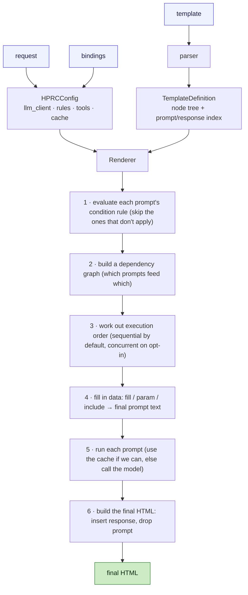

# HPRC Framework

### HTML Prompt Response Construction

> **Declarative AI rendering for web applications.**

[](https://pypi.org/project/hprc-framework/)
[](https://pypi.org/project/hprc-framework/)
[](LICENSE)

```bash
pip install hprc-framework
```

An open-source framework for declarative AI rendering. **Write SPREP templates** — HTML with embedded `<prompt>` / `<response>` elements — and let the HPRC Framework handle **prompt construction, dependency resolution, rule evaluation, tool invocation, caching, async execution, and response rendering**.

```
HPRC Framework
    ↓ supports
SPREP Templates   (Simple Prompt Response Embedded Pages)
```

**Developers write SPREP templates. The HPRC Framework renders them.**

*Created by Rajesh Ramani · `hprcframework.dev`*

> **Status:** open source under **Apache-2.0**, early release `0.1.0` (Alpha). Created by **Rajesh Ramani** · `hprcframework.dev`.

> **📖 Browse the HTML docs:** open [`docs/index.html`](docs/index.html) in a browser — a styled [User Guide](docs/user-guide.html) (with examples), an [Architecture & Design](docs/architecture.html) page, an HTML version of this README ([`README.html`](README.html)), and the [**SPREP language spec**](sprep/sprep-spec.html). All pages work offline except the Architecture page, which loads [Mermaid](https://mermaid.js.org) from a CDN to draw its diagrams. *(README.html is generated from Markdown with `python docs/build.py`, which needs [pandoc](https://pandoc.org).)*

> **📐 The SPREP template language** has its own specification: [`sprep/sprep-spec.md`](sprep/sprep-spec.md) ([HTML](sprep/sprep-spec.html)). HPRC is its reference implementation.

---

## What is HPRC? (in one minute)

Modern web pages increasingly want AI‑written pieces — a personalized greeting, a summary, a recommendation. Today you usually build those by writing Python that calls a language model, stitches the text together, and drops it into the page. The AI logic ends up scattered across your codebase, far from the page it belongs to.

**HPRC flips that around.** You write a normal HTML page and, right where you want AI text to appear, you drop in two things:

- a **`<prompt>`** — the instruction for the model, and
- a **`<response>`** — the spot where the model's answer should appear.

When the page renders, HPRC runs the prompts for you and fills in the answers. The `<prompt>` blocks themselves never appear in the final page — only their answers do.

> **A helpful way to picture it:** mail‑merge, but for AI. Your template has blanks; HPRC fills them — except the "blanks" are written by a language model that can read your data.

A tiny example:

```html
<h1>Hello <fill>customer.name</fill></h1>

<prompt id="welcome">Write a one-line welcome for <fill>customer.name</fill>.</prompt>
<response id="welcome"/>
```

Your Python code supplies the data (`customer.name`) and picks the model; HPRC does the rest.

## Why it exists

Most "LLM + web" code today is **imperative glue**: you receive a request, hand‑build prompt strings in Python, manually sequence dependent calls, await them, and splice the text into a template. The orchestration logic lives far away from the page it produces — which makes it hard to read, change, and reason about.

HPRC inverts that. The **template becomes the source of truth**:

- The **page author** writes prompts inline, next to where their output will appear.
- The **application developer** supplies only *data and policy* — a `bindings` dict, named rules, allowlisted tools, an LLM provider, and a cache — through a single `HPRCConfig`.
- **HPRC** does the orchestration for you: resolving data, deciding which prompts run, working out their order, executing them, caching, and stitching everything into the final HTML.

### Principles it sticks to

- **Integrates with any web framework** — use it with FastAPI, Flask, or Django, or run it standalone. HPRC never imports a web framework; it just normalizes whatever request object you pass into a plain namespace.
- **Works with any model provider** — OpenAI, Anthropic, Gemini, local models, or your own. Each is a tiny adapter behind one `generate(...)` method.
- **No logic or expressions in templates** — business rules stay in Python. Templates only *name* rules and tools; the actual predicates and functions live in your app.
- **Tools that actually run** — when a prompt declares tools, HPRC executes the ones the model calls (with the model's arguments) in a single iteration, feeds results back, and renders the model's next answer. (A multi-step agent loop is on the roadmap.)

---

## How it works (the short version)

You hand HPRC four things — a template, your data (`bindings`), the web request, and a config — and it hands back finished HTML. In between, one render goes through a few clear stages: it reads the template, decides which prompts should run, works out their order (some prompts depend on others), runs them, and stitches the answers back into the page.



The renderer (`hprc/renderer.py`) is the part that coordinates all this. Everything flowing through it is described by plain data models (`hprc/models.py`), which keeps the rest of the library simple and declarative. For the full step‑by‑step, see the [Architecture](docs/architecture.html) doc.

---

## Install

From PyPI:

```bash
pip install hprc-framework            # core (just pydantic) — then: import hprc
```

Optional provider / framework extras:

```bash
pip install "hprc-framework[anthropic]"   # Claude provider (anthropic)
pip install "hprc-framework[openai]"      # OpenAI / Ollama provider
pip install "hprc-framework[gemini]"      # Gemini provider
pip install "hprc-framework[fastapi]"     # FastAPI example (fastapi, uvicorn)
pip install "hprc-framework[all]"         # every provider SDK
```

The only required runtime dependency is `pydantic>=2.0`; provider SDKs are optional and lazily imported. Requires Python `>=3.9`.

**From source (for development):**

```bash
git clone https://github.com/HPRCFramework/hprc-framework
cd hprc-framework
python -m venv .venv && source .venv/bin/activate
pip install -e ".[dev]"               # editable install + tests
python -m pytest -q
```

---

## Quick Start

HPRC's public entry points are **async** coroutines. Run them inside an event loop. The default provider is the offline `MockLLMClient`, so this needs no API key.

> **`MockLLMClient` is for tests, demos and local development — not production.** It never calls a real model; it just echoes a summary of each request so you can develop and assert on prompt construction offline. For real generated output, swap in a real provider (`OpenAIClient`, `AnthropicClient`, `GeminiClient`, `OllamaClient`) — see [Shipped providers](#shipped-providers).

```python
import asyncio

import hprc
from hprc import MemoryCache, MockLLMClient, HPRCConfig

TEMPLATE = """<!DOCTYPE html>
<html><body>
  <h1>Hello <fill>customer.name</fill> (<fill>customer.tier</fill>)</h1>

  <prompt id="summary" model="gpt-5" condition="is_premium" temperature="0.2" cache="24h">
    Customer <fill>customer.name</fill> is interested in <param>product</param>.
    Write a one-line account summary.
  </prompt>

  <prompt id="upsell" model="gpt-5">
    Given: <include response="summary"/>
    Suggest one upsell.
  </prompt>

  <section><h2>Summary</h2><response id="summary"/></section>
  <section><h2>Upsell</h2><response id="upsell"/></section>
</body></html>"""


async def main():
    config = HPRCConfig(
        llm_client=MockLLMClient(),
        rules={"is_premium": lambda ctx: ctx["customer"]["tier"] == "premium"},
        tools={},
        cache=MemoryCache(),
    )
    html = await hprc.render_template_string(
        template_html=TEMPLATE,
        request={"query": {"product": "WidgetPro"}, "path": {}, "method": "GET"},
        bindings={"customer": {"name": "Ada", "tier": "premium"}},
        config=config,
    )
    print(html)


if __name__ == "__main__":
    asyncio.run(main())
```

(This is `examples/standalone.py` — run it with `python examples/standalone.py`.)

`upsell` depends on `summary` via `<include response="summary"/>`, so HPRC runs `summary` first and substitutes its (mock) response into `upsell`'s prompt automatically. The `<prompt>` blocks never appear in the output.

### Entry points

All defined in `hprc/renderer.py` and re-exported from `hprc`:

| Function | Use |
| --- | --- |
| `await render_template(template_path, request=None, bindings=None, config=None)` | Render a `.sprep.html` file. |
| `await render_template_string(template_html, request=None, bindings=None, config=None)` | Render template HTML supplied as a string (no file I/O). |
| `await render_string(template, request=None, bindings=None, config=None)` | Render an already-parsed `TemplateDefinition`. |
| `Renderer(config).render(template, render_context)` | The low-level object API. |

If `config` is omitted, a default `HPRCConfig()` is used (mock client, in-memory cache, no rules/tools).

---

## Your data: `bindings` (from your code) and `request` (from the web)

This is the part most people want to understand first: **how do my own values get into a prompt or the page?**

You hand HPRC a plain dictionary called **`bindings`** when you render. Anything in it is available to both your HTML *and* your prompts through `<fill>`. Typically your Python **business logic produces that dictionary** — querying a database, calling services, computing derived values — and passes it in:

```python
# your business logic produces a plain dict (JSON-like)
def build_customer_bindings(customer_id):
    record = load_customer(customer_id)          # e.g. from a database
    age    = compute_age(record["dob"])          # a derived value
    return {"customer": {"name": record["name"], "age": age,        # 55
                         "segment": "senior" if age >= 55 else "standard"}}

html = await hprc.render_template(
    template_path="customer_profile.sprep.html",
    bindings=build_customer_bindings("1001"),      # <-- your data flows in here
    config=config,
)
```

Now the same `customer.age` is usable **in the page and in a prompt**, from the template file:

```html
<p>Age: <fill>customer.age</fill></p>                              <!-- shown in the HTML -->
<prompt id="hi">Greet this <fill>customer.age</fill>-year-old customer.</prompt>
```

There are **two namespaces**, and `<fill>` reads from both:

| Namespace | What it holds | How you read it |
| --- | --- | --- |
| **`bindings`** | your business‑logic data / computed values | `<fill>customer.age</fill>` |
| **`request`** | the incoming web request | `<fill>request.query.product</fill>`, or the shortcut `<param>product</param>` |

> 📂 A complete, runnable version of this — business logic → `bindings` → one template used by both the HTML and a prompt — is in [`examples/customer_profile.py`](examples/customer_profile.py) and [`examples/templates/customer_profile.sprep.html`](examples/templates/customer_profile.sprep.html). Run it with `python examples/customer_profile.py`.

### What you get back: an HTML string (you send it to the response)

`render_template(...)` is an `async` function that **returns a `str`** — the finished HTML. HPRC **never touches the HTTP response**; it's a templating engine, not a web framework (it deliberately never imports FastAPI/Flask/Django). **You** put the string on the wire — which is exactly what lets HPRC drop into any stack:

```python
html = await hprc.render_template(...)   # -> str (the finished page)

return HTMLResponse(html)                # FastAPI / Starlette
return html                              # Flask  (or Response(html, mimetype="text/html"))
return HttpResponse(html)                # Django
open("out.html", "w").write(html)        # no framework — write a file, or print(html)
```

Symmetrically, the **request** is data you pass *in* via `request=` — either a framework request object (FastAPI/Starlette/Flask/Django) or a plain `{"query": ..., "path": ..., "method": ...}` dict. HPRC reads only **query params, path params and method** from it; headers, cookies and body are not consulted (put anything else in `bindings`).

So the whole contract is: **(optional `request` + `bindings`) in → HTML string out.** The HTTP request and response objects stay entirely in your framework code.

---

## Template Syntax Reference

A SPREP template is ordinary HTML plus a handful of special elements. The parser (stdlib `html.parser`) preserves text, entities, comments, the doctype and self-closing/void elements so the document round-trips faithfully.

### `<prompt>` — executable, tacit

Defines an LLM call. Its body is the prompt text (resolved at render time). It is **never rendered** into the output.

```html
<prompt
    id="summary"
    model="gpt-5"
    condition="is_premium_customer"
    temperature="0.2"
    max_tokens="500"
    cache="24h"
    async="yes"
    tools="crm_lookup,pricing_engine">
  You are a concise account analyst.
  Customer: <fill>customer.name</fill> (tier: <fill>customer.tier</fill>)
  Product of interest: <param>product</param>
  Write a 2-sentence summary.
</prompt>
```

Attributes (see `PromptDefinition` / `_build_prompt` in `hprc/parser.py`):

| Attribute | Type | Default | Meaning |
| --- | --- | --- | --- |
| `id` | string | **required** | Identifier; the matching `<response id="...">` renders this prompt's output. Duplicate ids raise `ValueError`. |
| `model` | string | `None` | Passed through to the provider (provider falls back to its own default). |
| `condition` | string | `None` | Name of a registered rule; the prompt only runs if the rule returns truthy. |
| `temperature` | float | `None` | Forwarded to the provider. |
| `max_tokens` | int | `None` | Forwarded to the provider. |
| `cache` | string | `None` | TTL spec like `"24h"`, `"30m"`, `"3600"`. Absent/empty = no caching. |
| `async` | bool | `no` | Sequential by default; set `async="yes"` to run this prompt concurrently with other `async` prompts in its level. Truthy values: `yes`, `true`, `1`, `on`. |
| `tools` | csv | empty | Comma-separated allowlist of registered tool names. |

### `<response>` — placeholder, with `render`

Where a prompt's output is injected, bound by `id`.

```html
<response id="summary"/>            <!-- rendered (default) -->
<response id="summary" render="yes"></response>
<response id="audit" render="no"/>  <!-- executed, but NOT shown -->
```

`render="no"` (also `false`, `0`, `off`) means the prompt still **executes** and its response is still available to other prompts via `<include>`, but it is not written into the page. Useful for intermediate/internal prompts.

### `<fill>` — data, dot-notation

Resolves a dotted path against the namespace `{**bindings, "request": request}` and writes it (HTML-escaped) into the page.

```html
<h1><fill>customer.name</fill></h1>
<p>Account #<fill>request.path.customer_id</fill></p>
```

Dot paths (`resolve_path` in `hprc/request_context.py`) traverse dict keys, object attributes and integer list indices (`items.1`). A missing segment yields an empty string, so templates degrade gracefully. In page output, `<fill>` is HTML-escaped (e.g. `<script>` → `&lt;script&gt;`); inside a prompt body it is inserted raw.

### `<param>` — request query shortcut

Shorthand for `request.query.<name>`:

```html
Viewing product: <param>product</param>
```

`<param>product</param>` is exactly `<fill>request.query.product</fill>`. Missing params resolve to an empty string.

### `request` namespace

HPRC normalizes any request object into a stable shape (`normalize_request`):

```python
{ "query": {...}, "path": {...}, "method": "GET" }
```

Address it from fills: `request.query.*`, `request.path.*`, `request.method`. Accepted inputs:

- `None` → empty namespace.
- A plain dict already shaped `{"query": ..., "path": ..., "method": ...}`.
- A FastAPI/Starlette `Request` (uses `query_params`, `path_params`, `method`).
- Any object exposing `query`/`path`/`method` or `query_params`/`path_params`/`method`.

### `<include>` — compose prompts

Used **inside a prompt body** to splice in another prompt's response or constructed text:

```html
<prompt id="upsell">
  Given this summary: <include response="summary"/>
  Suggest one upsell.
</prompt>
```

| Form | Inside a prompt body | In page output |
| --- | --- | --- |
| `<include response="X"/>` | inserts prompt `X`'s **response** text | inserts `X`'s response (alias for `<response id="X"/>`) |
| `<include prompt="X"/>` | inserts prompt `X`'s **constructed prompt text** | nothing (it is a prompt-construction directive only) |

`<include>` is what creates dependency edges in the graph (see below).

---

## Rules

Rules keep business logic out of templates. A template references a rule **by name only** via `condition="..."`; the predicate lives in Python and is supplied through `HPRCConfig.rules`.

```python
config = HPRCConfig(
    llm_client=MockLLMClient(),
    rules={"is_premium_customer": lambda ctx: ctx["customer"]["tier"] == "premium"},
)
```

```html
<prompt id="summary" condition="is_premium_customer"> … </prompt>
<section><response id="summary"/></section>
```

### How HPRC uses a rule

A rule is a **per-prompt gate** — it does **not** decide whether the renderer runs (the renderer always runs). It decides whether **one prompt** runs.

At the start of each render, HPRC walks every `<prompt>`. For a prompt with `condition="is_premium_customer"` it:

1. looks up `is_premium_customer` in `HPRCConfig.rules`;
2. calls it with the **bindings** dict (so the function's `ctx` argument *is* your `bindings` — note: bindings, **not** the request);
3. coerces the result to a bool.

If it's **truthy**, the prompt runs (the model is called and its `<response>` is filled). If it's **falsy**, the prompt is **skipped** — no model call — and its `<response>` renders **empty** (and any `<include response="summary"/>` of it resolves to `""`). A prompt with **no** `condition` always runs.

### One rule per prompt — no AND/OR in templates

Each prompt has **at most one** condition, and HPRC evaluates each prompt's condition **independently**, up front. There is deliberately **no expression language** in templates — you can't write `condition="a and b"`. For compound logic, put it **inside one rule function**:

```python
rules={
    "is_premium_customer": lambda ctx: ctx["customer"]["tier"] == "premium",
    "eligible_for_upsell": lambda ctx: (
        ctx["customer"]["tier"] == "premium" and ctx["account"]["balance"] > 0
    ),
}
```

The `rules` dict can hold many named rules; different prompts pick different ones by name (`hprc/rules.py`).

### Signature and error behavior

- **Signature:** `Callable[[dict], bool]`, receiving the render **bindings** (not the request).
- A **missing/unregistered** rule name is a configuration mistake and **fails loudly** — the render raises `RuleError` naming the prompt and the rule (so a typo in `condition=` is caught, not silently ignored).
- A rule that **runs but raises** (e.g. the bindings lack a key it reads) is treated as "condition not met" → that one prompt is **skipped** (its response becomes `""`), so a data gap degrades gracefully rather than failing the whole page.

---

## Tools

Tools are external to templates too: a template lists allowlisted tool *names* (`tools="weather,crm_lookup"`) and your app registers the callables. HPRC resolves the names to `ToolDefinition` objects and forwards them to the LLM client.

```python
def crm_lookup(customer: str) -> str:
    """Look up CRM notes for a customer."""
    return f"CRM notes for {customer}: no open tickets."

config = HPRCConfig(
    llm_client=MockLLMClient(),
    tools={"crm_lookup": crm_lookup, "pricing_engine": pricing_engine},
)
```

When a prompt declares tools, HPRC runs a **single tool iteration**: it calls the model with the prompt + tool schemas; if the model asks to call one or more tools, HPRC **runs your registered function(s) with the model's arguments**, feeds the result(s) back, and asks the model once more — that response is rendered. If the model is *still* requesting a tool after that single iteration, the prompt renders empty. (A multi-step agent loop is on the roadmap.)

- Registry values may be a **bare callable** (its docstring becomes the tool description) or a fully-built `ToolDefinition`. `normalize_tools` coerces them on config init (`hprc/tools.py`).
- The allowlist is enforced: a prompt may only call the tools it lists; an unregistered name raises `ToolError`, and a model asking for a non-allowed tool gets an error string back (it can recover).
- Tool-executing prompts are **not cached** (outputs are dynamic).
- **Provider support:** implemented for `OpenAIClient` (and `OllamaClient`) and `AnthropicClient`. `GeminiClient` forwards tool schemas but its execution loop isn't implemented yet (falls back to a single text generation).
- **Single iteration, not an agent** — HPRC runs exactly one round of tool execution per prompt. A multi-step agent loop and MCP are on the roadmap.

`ToolDefinition` fields: `name`, `func`, `description`, `parameters` (a JSON-schema-style dict; `OpenAIClient` forwards these as OpenAI function-tool schemas).

---

## Request Parameters

The `request` argument to the entry points is normalized once per render into `{query, path, method}`. From there:

- `<param>name</param>` → `request.query.name`.
- `<fill>request.path.id</fill>` → path parameter `id`.
- `<fill>request.method</fill>` → the HTTP method string.

```python
html = await hprc.render_template_string(
    "<a><param>product</param></a><b><fill>request.query.product</fill></b>",
    request={"query": {"product": "WidgetPro"}},
)
# -> <a>WidgetPro</a><b>WidgetPro</b>
```

---

## Dependency Graphs

A prompt depends on another when its body includes that prompt's response (`<include response="A"/>`) or constructed text (`<include prompt="A"/>`). HPRC builds this graph automatically — you never sequence prompts by hand (`hprc/dependency_graph.py`).

```python
from hprc import parse, build_graph, topological_levels

tpl = parse(
    '<prompt id="a">A</prompt>'
    '<prompt id="b">uses <include response="a"/></prompt>'
)
graph = build_graph(tpl.prompts)         # {"a": set(), "b": {"a"}}
topological_levels(graph)                # [["a"], ["b"]]
```

- `build_graph` produces `{prompt_id: {dependency_ids}}`, restricted to ids that are actually prompts (self-references dropped).
- `topological_levels` runs Kahn's algorithm and returns **execution levels**: each inner list is a set of prompts with no remaining dependencies that can run concurrently; later levels wait for earlier ones. Ties within a level are sorted for determinism.
- A cycle raises `DependencyError`.

---

## Async Execution

By default, prompts run **one at a time (sequentially)** — simple and predictable. When you have independent prompts that would benefit from running together (e.g. several panels on a dashboard), you opt them into concurrency with `async="yes"`. The renderer walks the dependency levels and, within each level, runs the `async="yes"` prompts together with `asyncio.gather` while the rest run one by one — so a level can be sequential, concurrent, or a mix (`Renderer._execute_all`):

```python
for level in topological_levels(graph):
    concurrent = []
    for pid in level:
        prompt = template.prompts[pid]
        if prompt.is_async:            # async="yes" → run concurrently
            concurrent.append(self._execute_prompt(prompt, ...))
        else:                          # default → run sequentially
            await self._execute_prompt(prompt, ...)
    if concurrent:
        await asyncio.gather(*concurrent)
```

Dependent prompts always wait for the responses they include, regardless of `async`. This is verified in `tests/test_async.py` (sequential by default; `async="yes"` runs concurrently; a level can mix both; dependent prompts run in order). All entry points are coroutines — drive them from an event loop.

---

## Chaining responses forward (`gather_responses`)

Sometimes you want each prompt to see what the earlier prompts produced, without wiring up an `<include>` for every link. Pass `gather_responses=True` to the render call and HPRC builds up a running transcript: each **sequential** prompt receives the responses of the earlier sequential prompts in the render, prepended as context.

```python
html = await hprc.render_template_string(tpl, config=cfg, gather_responses=True)
```

- Only **sequential** prompts participate — `async="yes"` (concurrent) prompts have no defined order, so they are **excluded** from the chain (neither contribute to nor receive the gathered context).
- It's off by default; explicit `<include>` still works independently.
- Because the gathered text becomes part of the prompt, it's reflected in the cache key, so caching stays correct.

(This is render-internal chaining. Passing in an *external* conversation history — `prior_context` — and a `<system>` role are on the roadmap.)

---

## Cache Support

Per-prompt caching is opt-in via the `cache` attribute, with a human-friendly TTL spec:

```html
<prompt id="summary" cache="24h">...</prompt>
```

`parse_ttl` (in `hprc/cache.py`) accepts `s/m/h/d/w` units (`"30m"`, `"24h"`, `"2d"`, `"1w"`), a bare integer as seconds (`"3600"`), and treats `None`/empty **and a non-positive value (`"0"`)** as "no caching". Invalid specs raise `ValueError`.

The cache key (`build_cache_key`) is a SHA-256 over everything that can change the output: the fully-resolved prompt text (which already embeds fills, params and included responses), `model`, `temperature`, `max_tokens`, and the **sorted** tool names (so tool order doesn't matter). On a hit, the LLM is not called.

```python
client = MockLLMClient()
cfg = HPRCConfig(llm_client=client, cache=MemoryCache())
tpl = '<prompt id="a" cache="24h">hello</prompt><x><response id="a"/></x>'

await hprc.render_template_string(tpl, config=cfg)
await hprc.render_template_string(tpl, config=cfg)
assert len(client.calls) == 1   # second render served from cache
```

Cache backends implement the `Cache` ABC (`async get(key)`, `async set(key, value, ttl)`):

- `MemoryCache` — in-process TTL cache. Accepts an injectable `time_func` for deterministic expiry in tests; has a `clear()` helper.
- `NullCache` — stores nothing; every lookup misses.

The abstraction is deliberately minimal so a Redis-backed cache can be dropped in without touching the renderer. If `HPRCConfig(cache=None)` is passed, it defaults back to a `MemoryCache`.

---

## Provider Abstraction

Every provider implements one coroutine (`hprc/llm.py`):

```python
class LLMClient(ABC):
    @abstractmethod
    async def generate(
        self,
        prompt: str,
        model: str | None = None,
        temperature: float | None = None,
        max_tokens: int | None = None,
        tools: list[ToolDefinition] | None = None,
    ) -> str: ...
```

### Shipped providers

Every provider SDK is imported **lazily**, so `import hprc` never requires any of them. Install only the extras you use (`pip install -e ".[anthropic]"`, `".[gemini]"`, `".[openai]"`, or `".[all]"`).

| Client | Backend | Extra |
|--------|---------|-------|
| `MockLLMClient` | deterministic, offline (echoes the request, records `.calls`); accepts a `responder` to script outputs. **Tests/demos/dev only — not production.** | — |
| `OpenAIClient(api_key, default_model)` | official async `openai` client; tools → OpenAI function-tool schemas | `openai` |
| `AnthropicClient(api_key, default_model, default_max_tokens)` | `anthropic` async Messages API (Claude); supplies the **required** `max_tokens`; joins text blocks | `anthropic` |
| `GeminiClient(api_key, default_model)` | `google-genai` async API; params under `config`, `max_tokens` → `max_output_tokens` | `gemini` |
| `OllamaClient(base_url, default_model)` | local OpenAI-compatible endpoint (Ollama / LM Studio) — an `OpenAIClient` with a local `base_url` | — |
| `MultiProviderClient({name: client}, default=…)` | routes by a `"provider:model"` prefix | — |

```python
from hprc import OpenAIClient, AnthropicClient, GeminiClient, OllamaClient

HPRCConfig(llm_client=OpenAIClient(api_key=os.environ["OPENAI_API_KEY"]))
HPRCConfig(llm_client=AnthropicClient(api_key=os.environ["ANTHROPIC_API_KEY"]))
HPRCConfig(llm_client=GeminiClient(api_key=os.environ["GOOGLE_API_KEY"]))
HPRCConfig(llm_client=OllamaClient(base_url="http://localhost:11434/v1", default_model="llama3"))
```

**Client = provider, `model` = sub-selection.** The client you put in `HPRCConfig` fixes the provider; a prompt's `model="..."` only picks the variant within it.

### Routing by `model` + portable aliases

To let the `model` value also choose the *provider*, use `MultiProviderClient` (prefix routing) and/or `model_aliases` (logical names resolved before each call — also used in the cache key):

```python
config = HPRCConfig(
    llm_client=MultiProviderClient(
        {"openai": OpenAIClient(), "anthropic": AnthropicClient()},
        default="openai",
    ),
    model_aliases={"summarizer": "anthropic:claude-sonnet-4-6"},
)
# template:  <prompt model="summarizer">   -> routed to Anthropic as claude-sonnet-4-6
#            <prompt model="gpt-5">         -> no prefix -> default (OpenAI)
```

### Adding another provider

Subclass `LLMClient`, implement `generate`, and lazy-import the SDK inside `_get_client`. No changes to the renderer or templates. A mocked conformance test in `tests/test_providers.py` shows the contract every client must satisfy (request mapping + text extraction); copy a case for your new adapter.

---

## Module Layout

```
hprc/
  __init__.py            # public API surface + __version__
  config.py              # HPRCConfig — bundles llm_client, rules, tools, cache
  models.py              # Pydantic models: Node, Prompt/Response/Include, Template, RenderContext, ToolDefinition
  parser.py              # tolerant HTML→Node tree + prompt/response extraction (parse, parse_file)
  renderer.py            # orchestration core + entry points (render_template[_string], render_string, Renderer)
  request_context.py     # normalize_request + resolve_path (dot-notation)
  rules.py               # named-rule evaluation (evaluate_rule, RuleError)
  tools.py               # tool registration/resolution (normalize_tools, resolve_tools, ToolError)
  dependency_graph.py    # build_graph + topological_levels (Kahn), DependencyError
  cache.py               # parse_ttl, build_cache_key, Cache/MemoryCache/NullCache
  llm.py                 # LLMClient ABC, MockLLMClient, OpenAIClient

examples/
  standalone.py          # no-framework demo (MockLLMClient)
  fastapi_app.py         # FastAPI integration demo
  templates/customer.sprep.html

tests/                   # pytest suite (asyncio_mode = auto)
```

Public exports (`hprc.__all__`): `render_template`, `render_template_string`, `render_string`, `Renderer`, `HPRCConfig`, `LLMClient`, `MockLLMClient`, `OpenAIClient`, `Cache`, `MemoryCache`, `NullCache`, `build_cache_key`, `parse_ttl`, `parse`, `parse_file`, `build_graph`, `topological_levels`, and the model classes.

---

## Running Tests

`pytest` is configured with `asyncio_mode = "auto"` (no `@pytest.mark.asyncio` needed) and `testpaths = ["tests"]`:

```bash
pip install -e ".[dev]"
pytest -q
```

The suite (76 tests) covers parsing, fill/path resolution, request normalization, rules, tool execution, rendering & tacit prompts, the dependency graph, async concurrency, response gathering, caching, and a mocked provider-conformance suite.

---

## Roadmap

HPRC's render path stays **synchronous and bounded**; these are the planned additions, grouped by theme. *Recently shipped:* provider adapters (OpenAI/Anthropic/Gemini/Ollama), single-iteration tool execution, response gathering, and the `context → bindings` rename.

- **Tooling & MCP**
  - A **multi-step (bounded) agent loop** — beyond today's single tool iteration.
  - **MCP** (Model Context Protocol) integration — discover & execute MCP tools via the same allow-list.
  - Gemini tool execution; tool results as embeddable content.
- **Conversational / multi-turn** *(HPRC stays stateless — the app owns persistence)*
  - **`prior_context`** — pass in an existing message chain (roles preserved).
  - **`<system>` role** — a system-message directive prepended to prompt calls.
  - **`RenderResult.messages`** — return the turns so the app can persist history and replay it.
- **Response shaping**
  - **Structured output → fills** — a prompt returns JSON whose fields fill many placeholders (`<fill>card.title</fill>`); the template owns layout, values stay escaped.
  - **`format` attribute** — `text` (safe default), `markdown` (→ sanitized HTML), `html` (sanitized, opt-in).
  - **`<each>`** — iteration for rendering lists.
- **Data composition**
  - Raw/trusted HTML injection (`<fill raw>` + sanitizer).
  - **Async data providers** in the dependency graph (DB/API fetches running alongside prompts).
  - **`retrieved_context`** (RAG) + a retriever seam.
- **Execution models — render-time vs. live**
  - **Live regions / real-time widgets** — a *separate* post-render model: the render emits a placeholder + client hook, and a companion endpoint runs the loop and streams updates (SSE/WebSocket).
  - **Progressive / streaming render** — flush each `<response>` as it completes.

**Naming taxonomy** (adopted): `bindings` = page data · `prior_context` = conversation · `retrieved_context` = RAG · `request` = the web request. Principle: *`*_context` feeds the model's context window; `bindings` is page data.*

---

## License & Author

**Apache-2.0** — see [LICENSE](LICENSE) and [NOTICE](NOTICE). Copyright 2026 **Rajesh Ramani**.

HPRC Framework is an open-source project created by Rajesh Ramani. Early release `0.1.0` (alpha) — contributions and feedback welcome. Website: `hprcframework.dev`.

> **Architecture ideated and designed by Rajesh Ramani; developed with Claude (Anthropic).**
